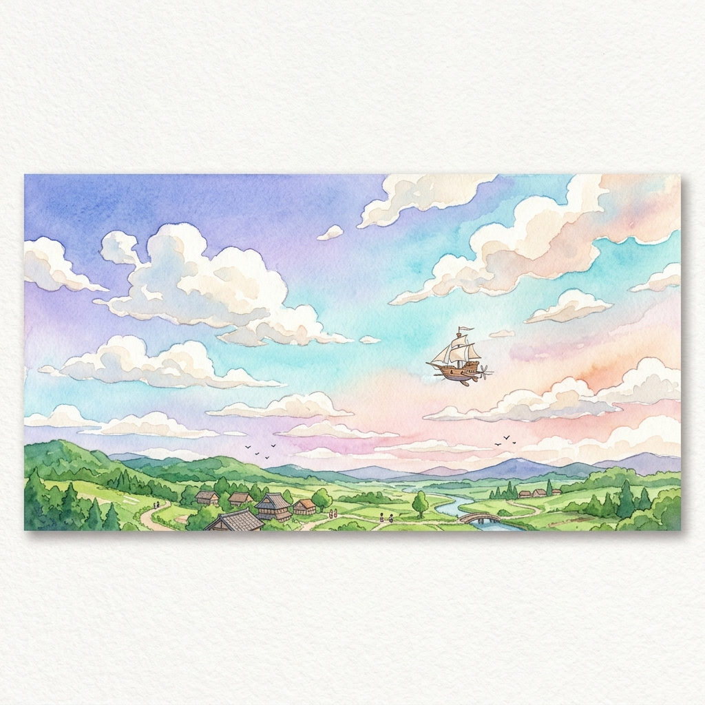

# 🌟 Joy Star Catcher

> A Ghibli-style 2D storybook game that builds self-esteem and confidence in young children through joyful, interactive play.



---

## ✨ About

**Joy Star Catcher** is a mobile-first children's game where kids tap the screen to move Daniel — a friendly character in a hand-painted Studio Ghibli-inspired world — and catch falling stars. Every star caught triggers a warm spoken affirmation ("You are amazing!", "You are so brave!") delivered by the browser's built-in speech engine, alongside a burst of confetti and a cheerful pose.

The game is designed to be:
- 🎨 **Visually stunning** — parallax painted backgrounds with soft watercolour layers
- 🗣️ **Encouraging** — real-time spoken affirmations on every catch using the Web Speech API
- 📱 **Mobile-first** — tap-to-move controls, full-screen layout, no install required
- 🚀 **Fast** — loads in seconds, zero external audio dependencies

---

## 🎮 Gameplay

| Action | How |
|--------|-----|
| Move Daniel | Tap / click anywhere on the screen |
| Catch a star | Move Daniel under a falling star |
| Hear an affirmation | Automatic on every catch |
| See confetti | Automatic on every catch |

Stars fall continuously. The further you tap from Daniel, the faster he runs to reach that spot. A score counter tracks how many stars you've caught.

---

## 🖼️ Art Style

The game features a hand-crafted Ghibli-inspired visual style:

- **Parallax sky** — soft gradient painted sky that subtly shifts as Daniel moves
- **Rolling hills** — watercolour mid-ground hills with wildflowers
- **Ground layer** — detailed grassy foreground platform
- **Daniel sprites** — four distinct poses: idle, run, catch, and cheer

---

## 🛠️ Tech Stack

| Layer | Technology |
|-------|-----------|
| Framework | [TanStack Start](https://tanstack.com/start) (SSR + React 19) |
| Routing | [TanStack Router](https://tanstack.com/router) |
| Build | [Vite 8](https://vite.dev) + [Nitro](https://nitro.build) |
| Styling | [Tailwind CSS v4](https://tailwindcss.com) |
| Voice | Web Speech API (SpeechSynthesis) — free, zero dependencies |
| Language | TypeScript |
| Deployment | [Vercel](https://vercel.com) via Nitro auto-preset |

---

## 🚀 Getting Started

### Prerequisites

- Node.js ≥ 22.12.0
- npm ≥ 10

### Install & Run Locally

```bash
# Clone the repository
git clone https://github.com/gigscode/joy-star-catcher.git
cd joy-star-catcher

# Install dependencies
npm install

# Start the development server
npm run dev
```

Open [http://localhost:8080](http://localhost:8080) in your browser.

### Build for Production

```bash
npm run build
```

The build outputs to `.output/` — a Nitro-managed directory containing both the static client bundle and the SSR server entry point.

---

## 📁 Project Structure

```
joy-star-catcher/
├── src/
│   ├── assets/
│   │   └── images/          # Character sprites & parallax background layers
│   ├── lib/
│   │   ├── error-capture.ts # SSR error capture utility
│   │   ├── error-page.ts    # Fallback HTML error page
│   │   └── utils.ts         # General utilities
│   ├── routes/
│   │   ├── __root.tsx       # App shell, head metadata
│   │   └── index.tsx        # Game component (all gameplay logic)
│   ├── server.ts            # SSR server entry (TanStack Start + h3)
│   ├── start.ts             # TanStack Start instance + error middleware
│   └── styles.css           # Global styles & animation keyframes
├── vite.config.ts           # Vite + TanStack Start + Nitro config
├── tsconfig.json
└── package.json
```

---

## 🌐 Deploying to Vercel

The project is pre-configured for Vercel. Nitro automatically detects the Vercel environment and applies the correct serverless preset.

**Via Vercel Dashboard (recommended):**
1. Go to [vercel.com/new](https://vercel.com/new)
2. Import the `gigscode/joy-star-catcher` GitHub repository
3. Click **Deploy** — no custom settings needed

**Via Vercel CLI:**
```bash
npm install -g vercel
vercel --prod
```

Every push to `main` triggers an automatic deployment.

---

## 💬 Affirmations

The game includes 8 rotating affirmations spoken aloud on every star catch:

- ⭐ You are so smart!
- ⭐ You are a great helper!
- ⭐ You are deeply loved!
- ⭐ You are kind!
- ⭐ You can do hard things!
- ⭐ You bring joy!
- ⭐ You are amazing!
- ⭐ You are brave!

Voice is delivered via the browser's built-in [`SpeechSynthesis`](https://developer.mozilla.org/en-US/docs/Web/API/SpeechSynthesis) API — works on Chrome, Safari, Edge, and Firefox with no API keys or network requests required.

---

## 📄 License

MIT — feel free to use, fork, and share the joy. 🌟
